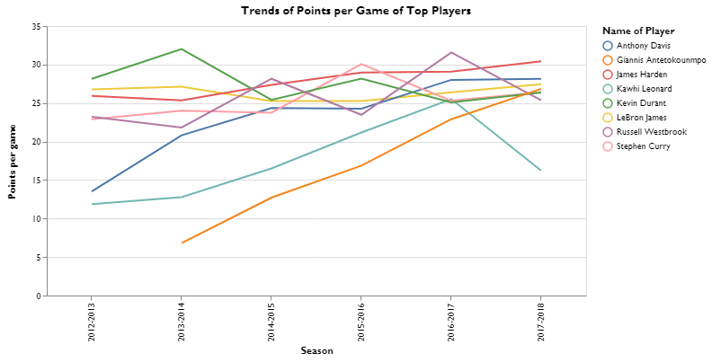
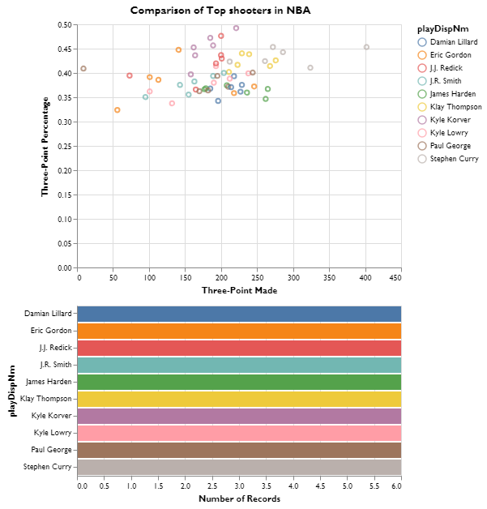

## Exploratory Data Visualization - using matplotlib, seaborn, and altair to explore a dataset

Second Assignment of MUSA 620 Data Wrangling and Data Visualization at University of Pennsylvania

We will be exploring the box score and standing statistics dataset from the NBA (2012-present). The original dataset is posted on https://www.kaggle.com/pablote/nba-enhanced-stats#2012-18_playerBoxScore.csv

### Making Sense of Data


```python
import pandas as pd
import datetime
import matplotlib.pyplot as plt
import seaborn as sns
import altair as alt

alt.renderers.enable('notebook')
```


    RendererRegistry.enable('notebook')


```python
dat = pd.read_csv('2012-18_playerBoxScore.csv', engine='python', parse_dates=['gmDate'])
```


```python
dat.head()
```


<table border="1" class="dataframe">
  <thead>
    <tr style="text-align: right;">
      <th></th>
      <th>gmDate</th>
      <th>gmTime</th>
      <th>seasTyp</th>
      <th>playLNm</th>
      <th>playFNm</th>
      <th>teamAbbr</th>
      <th>teamConf</th>
      <th>teamDiv</th>
      <th>teamLoc</th>
      <th>teamRslt</th>
      <th>...</th>
      <th>playFT%</th>
      <th>playORB</th>
      <th>playDRB</th>
      <th>playTRB</th>
      <th>opptAbbr</th>
      <th>opptConf</th>
      <th>opptDiv</th>
      <th>opptLoc</th>
      <th>opptRslt</th>
      <th>opptDayOff</th>
    </tr>
  </thead>
  <tbody>
    <tr>
      <th>0</th>
      <td>2012-10-30</td>
      <td>19:00</td>
      <td>Regular</td>
      <td>Price</td>
      <td>A.J.</td>
      <td>WAS</td>
      <td>East</td>
      <td>Southeast</td>
      <td>Away</td>
      <td>Loss</td>
      <td>...</td>
      <td>1.0</td>
      <td>1</td>
      <td>1</td>
      <td>2</td>
      <td>CLE</td>
      <td>East</td>
      <td>Central</td>
      <td>Home</td>
      <td>Win</td>
      <td>0</td>
    </tr>
    <tr>
      <th>1</th>
      <td>2012-10-30</td>
      <td>19:00</td>
      <td>Regular</td>
      <td>Ariza</td>
      <td>Trevor</td>
      <td>WAS</td>
      <td>East</td>
      <td>Southeast</td>
      <td>Away</td>
      <td>Loss</td>
      <td>...</td>
      <td>0.5</td>
      <td>1</td>
      <td>2</td>
      <td>3</td>
      <td>CLE</td>
      <td>East</td>
      <td>Central</td>
      <td>Home</td>
      <td>Win</td>
      <td>0</td>
    </tr>
    <tr>
      <th>2</th>
      <td>2012-10-30</td>
      <td>19:00</td>
      <td>Regular</td>
      <td>Okafor</td>
      <td>Emeka</td>
      <td>WAS</td>
      <td>East</td>
      <td>Southeast</td>
      <td>Away</td>
      <td>Loss</td>
      <td>...</td>
      <td>0.5</td>
      <td>5</td>
      <td>2</td>
      <td>7</td>
      <td>CLE</td>
      <td>East</td>
      <td>Central</td>
      <td>Home</td>
      <td>Win</td>
      <td>0</td>
    </tr>
    <tr>
      <th>3</th>
      <td>2012-10-30</td>
      <td>19:00</td>
      <td>Regular</td>
      <td>Beal</td>
      <td>Bradley</td>
      <td>WAS</td>
      <td>East</td>
      <td>Southeast</td>
      <td>Away</td>
      <td>Loss</td>
      <td>...</td>
      <td>1.0</td>
      <td>0</td>
      <td>3</td>
      <td>3</td>
      <td>CLE</td>
      <td>East</td>
      <td>Central</td>
      <td>Home</td>
      <td>Win</td>
      <td>0</td>
    </tr>
    <tr>
      <th>4</th>
      <td>2012-10-30</td>
      <td>19:00</td>
      <td>Regular</td>
      <td>Booker</td>
      <td>Trevor</td>
      <td>WAS</td>
      <td>East</td>
      <td>Southeast</td>
      <td>Away</td>
      <td>Loss</td>
      <td>...</td>
      <td>0.0</td>
      <td>1</td>
      <td>0</td>
      <td>1</td>
      <td>CLE</td>
      <td>East</td>
      <td>Central</td>
      <td>Home</td>
      <td>Win</td>
      <td>0</td>
    </tr>
  </tbody>
</table>
<p>5 rows × 51 columns</p>
</div>


```python
dat.columns
```


    Index(['gmDate', 'gmTime', 'seasTyp', 'playLNm', 'playFNm', 'teamAbbr',
           'teamConf', 'teamDiv', 'teamLoc', 'teamRslt', 'teamDayOff', 'offLNm1',
           'offFNm1', 'offLNm2', 'offFNm2', 'offLNm3', 'offFNm3', 'playDispNm',
           'playStat', 'playMin', 'playPos', 'playHeight', 'playWeight',
           'playBDate', 'playPTS', 'playAST', 'playTO', 'playSTL', 'playBLK',
           'playPF', 'playFGA', 'playFGM', 'playFG%', 'play2PA', 'play2PM',
           'play2P%', 'play3PA', 'play3PM', 'play3P%', 'playFTA', 'playFTM',
           'playFT%', 'playORB', 'playDRB', 'playTRB', 'opptAbbr', 'opptConf',
           'opptDiv', 'opptLoc', 'opptRslt', 'opptDayOff'],
          dtype='object')


### Creating a new column & Group by


```python
pattern = '%Y-%m-%d'

def Season_Identifier(x):
    if x < datetime.datetime.strptime('2013-5-1', pattern):
        return '2012-2013'
    elif x < datetime.datetime.strptime('2014-5-1', pattern):
        return '2013-2014'
    elif x < datetime.datetime.strptime('2015-5-1', pattern):
        return '2014-2015'
    elif x < datetime.datetime.strptime('2016-5-1', pattern):
        return '2015-2016'
    elif x < datetime.datetime.strptime('2017-5-1', pattern):
        return '2016-2017'
    else:
        return '2017-2018'
    
    
dat['Season'] = dat['gmDate'].apply(lambda x : Season_Identifier(x))
```


```python
team_stats = dat.groupby(['gmDate', 'teamAbbr', 'teamConf', 'Season'])['playPTS'].sum().reset_index()
```


```python
team_stats_season = team_stats.groupby(['Season', 'teamAbbr', 'teamConf'])['playPTS'].mean().reset_index()
```

### 1st plot via Seaborn


```python
sns.set(style = "whitegrid", palette = "pastel", color_codes = True)

sns.violinplot(x = "Season", y = "playPTS", hue = "teamConf",
               split = True, inner = "quart",
               data = team_stats_season)

fig = plt.gcf()
fig.set_size_inches(10, 6)
plt.xlabel('Season', fontsize=14)
plt.ylabel('Average Points per Team', fontsize=14)
plt.title('Distribution of Points by Conference by Season', fontsize=18)
```


    Text(0.5, 1.0, 'Distribution of Points by Conference by Season')


> The reason why a violin plot is chosen is that it is able to convey three dimensional messages (in this case, distribution of points per game of each team, different seasons, and different conferences). As shown above, for the first three seasons in the dataset, the distribution of points per game in both conferences were more concentrated, and that teams in Western Conference can score more points. After 2015-2016 NBA Season, average points per game in the entire league increase, and the distribution of Western Conference has become more spread. There are a few teams in the Western Conference that play offense pretty well.

### 2nd plot via Seaborn


```python
sns.boxenplot(x="Season", y="playPTS",
              color="b",
              scale="linear", data=team_stats_season)

fig = plt.gcf()
fig.set_size_inches(10, 6)
plt.xlabel('Season', fontsize=14)
plt.ylabel('Average Points per Game per Team', fontsize=14)
plt.title('Distribution of Points per Game by Season', fontsize=18)
```


    Text(0.5, 1.0, 'Distribution of Points per Game by Season')


> The above plot tells a similar story. After 2015-2016 Season, teams in NBA have begun to play offence better than before.

### Creating a new dataset for plotting


```python
boxscore = dat.groupby(['gmDate', 'teamAbbr'])['playPTS'].sum().reset_index()
boxscore['Month'] = boxscore['gmDate'].apply(lambda x : '%d-%02d' % (x.year, x.month))

team_score_month = boxscore.groupby(['Month', 'teamAbbr'])['playPTS'].mean().reset_index()
```


```python
team_score_month.describe()
```


<div>
<style scoped>
    .dataframe tbody tr th:only-of-type {
        vertical-align: middle;
    }

    .dataframe tbody tr th {
        vertical-align: top;
    }

    .dataframe thead th {
        text-align: right;
    }
</style>
<table border="1" class="dataframe">
  <thead>
    <tr style="text-align: right;">
      <th></th>
      <th>playPTS</th>
    </tr>
  </thead>
  <tbody>
    <tr>
      <th>count</th>
      <td>1252.000000</td>
    </tr>
    <tr>
      <th>mean</th>
      <td>102.272359</td>
    </tr>
    <tr>
      <th>std</th>
      <td>6.678720</td>
    </tr>
    <tr>
      <th>min</th>
      <td>75.000000</td>
    </tr>
    <tr>
      <th>25%</th>
      <td>98.000000</td>
    </tr>
    <tr>
      <th>50%</th>
      <td>102.345238</td>
    </tr>
    <tr>
      <th>75%</th>
      <td>106.540625</td>
    </tr>
    <tr>
      <th>max</th>
      <td>125.500000</td>
    </tr>
  </tbody>
</table>
</div>


### 3rd plot via Altair


```python
colormap = alt.Scale(domain=[0, 80, 90, 95, 100, 107, 115, 130],
                     range=["#2166ac","#4393c3","#92c5de","#d1e5f0","#fddbc7","#f4a582","#d6604d","#b2182b"],
                     type='sqrt')

alt.Chart(team_score_month).mark_rect().encode(
    x='Month:O',
    y=alt.Y('teamAbbr', axis=alt.Axis(title='Team')),
    color=alt.Color('playPTS', scale=colormap, legend=alt.Legend(title="Points per Game")),
    tooltip=['Month', 
             alt.Tooltip('teamAbbr', title = 'Team'), 
             alt.Tooltip('playPTS', title = 'Points per Game')]
).properties(title = 'Average Points per Month per Team'
)

```


    <vega.vegalite.VegaLite at 0x163eea0b780>


    


> The above heatmap illustrates that generally speaking, average points per game per month of almost every team becomes higher in latest seasons.

### 4th plot via Altair


```python
player_stats = dat.groupby(['Season', 'playDispNm', 'teamConf']).agg({'playPTS': 'mean', 'playFGA': 'sum', 'playFGM': 'sum', 'play3PA': 'sum',
                                                        'play3PM': 'sum',}).reset_index()

player_stats['FG_pct'] = player_stats['playFGM'] / player_stats['playFGA']
player_stats['Three_pct'] = player_stats['play3PM'] / player_stats['play3PA']
player_stats['FG_pct'].fillna(0, inplace = True)
player_stats['Three_pct'].fillna(0, inplace = True)
```


```python
brush = alt.selection_interval()

alt.Chart(player_stats).mark_point().encode(
    x=alt.X('play3PA', axis=alt.Axis(title='Three-Point Attempt')),
    y=alt.X('Three_pct', axis=alt.Axis(title='Three-Point Percentage')),
    color=alt.condition(brush, 'Season', alt.value('lightgray')),
    tooltip=[alt.Tooltip('playDispNm', title = 'Name'),
             alt.Tooltip('Season', title = 'Season'),
            alt.Tooltip('play3PA', title = 'Three-Point Attempt'),
            alt.Tooltip('Three_pct', title = 'Three-Point Percentage')]
).properties(
    width=200, 
    height=200,
    selection=brush
).facet(row='Season'
       )
```


    <vega.vegalite.VegaLite at 0x163ee0790f0>


    


> Let's try to find the reasons behind. The facetted scatter plot above displays each player's three-point attempts and his three-point percentage (the frequency that a player can hit a 3-point shot) in each season. It can be noted that the percentages have not changed much. However, in 2012-2013 season, only Stephen Curry attempted over 600 3-point shots, while in the last season (2017-2018), 5 players attempted more than 600 3-point shots. This may indicate that more 3pt attempts (and hence more 3pt field goals) leads to higher scores per game.

### Creating a new dataset for plotting


```python
GSW = dat[dat['playDispNm'].isin(['Stephen Curry', 'Klay Thompson', 'Kevin Durant', 'Draymond Green'])]
```


```python
GSW = GSW[GSW['Season'] == '2017-2018']
```

### 5th plot via Matplotlib


```python
plt.style.use('seaborn-whitegrid')

fig, ax = plt.subplots()

ax.hist(GSW[GSW['playDispNm'] == 'Stephen Curry']['playPTS'], histtype="stepfilled", 
        bins = 15, alpha = 0.4, color = '#F8B195', density=True)
ax.hist(GSW[GSW['playDispNm'] == 'Klay Thompson']['playPTS'], histtype="stepfilled", 
        bins = 15, alpha = 0.4, color = '#F67280', density=True)
ax.hist(GSW[GSW['playDispNm'] == 'Draymond Green']['playPTS'], histtype="stepfilled", 
        bins = 15, alpha = 0.4, color = '#C06C84', density=True)
ax.hist(GSW[GSW['playDispNm'] == 'Kevin Durant']['playPTS'], histtype="stepfilled", 
        bins = 15, alpha = 0.4, color = '#6C5B7B', density=True)

ax.legend(labels = ['Stephen Curry', 'Klay Thompson', 'Draymond Green', 'Kevin Durant'])

fig = plt.gcf()
fig.set_size_inches(8, 6)
plt.xlabel('Points', fontsize=14)
plt.ylabel('Frequency', fontsize=14)
plt.title('Distribution of Points by Player', fontsize=18)
```


    Text(0.5, 1.0, 'Distribution of Points by Player')


> Other than identifying patterns of the entire league, this notebook also dives into micro-level patterns. The above layered histogram details the distribution of points by selected players in Golden State Warriors. In 2017-2018 season, all of these four players are nominated as an "All-Star". It seems that Stephen Curry and Kevin Durant normally score more points than their all-star teammates.

### Creating a new dataset and making the 6th plot via Altair


```python
MVP = dat[dat['playDispNm'].isin(['Stephen Curry', 'James Harden'])]
MVP = MVP[MVP['Season'] == '2017-2018']
```


```python
MVP.head()
```


<div>
<style scoped>
    .dataframe tbody tr th:only-of-type {
        vertical-align: middle;
    }

    .dataframe tbody tr th {
        vertical-align: top;
    }

    .dataframe thead th {
        text-align: right;
    }
</style>
<table border="1" class="dataframe">
  <thead>
    <tr style="text-align: right;">
      <th></th>
      <th>gmDate</th>
      <th>gmTime</th>
      <th>seasTyp</th>
      <th>playLNm</th>
      <th>playFNm</th>
      <th>teamAbbr</th>
      <th>teamConf</th>
      <th>teamDiv</th>
      <th>teamLoc</th>
      <th>teamRslt</th>
      <th>...</th>
      <th>playORB</th>
      <th>playDRB</th>
      <th>playTRB</th>
      <th>opptAbbr</th>
      <th>opptConf</th>
      <th>opptDiv</th>
      <th>opptLoc</th>
      <th>opptRslt</th>
      <th>opptDayOff</th>
      <th>Season</th>
    </tr>
  </thead>
  <tbody>
    <tr>
      <th>129625</th>
      <td>2017-10-17</td>
      <td>10:30</td>
      <td>Regular</td>
      <td>Harden</td>
      <td>James</td>
      <td>HOU</td>
      <td>West</td>
      <td>Southwest</td>
      <td>Away</td>
      <td>Win</td>
      <td>...</td>
      <td>1</td>
      <td>5</td>
      <td>6</td>
      <td>GS</td>
      <td>West</td>
      <td>Pacific</td>
      <td>Home</td>
      <td>Loss</td>
      <td>0</td>
      <td>2017-2018</td>
    </tr>
    <tr>
      <th>129634</th>
      <td>2017-10-17</td>
      <td>10:30</td>
      <td>Regular</td>
      <td>Curry</td>
      <td>Wardell</td>
      <td>GS</td>
      <td>West</td>
      <td>Pacific</td>
      <td>Home</td>
      <td>Loss</td>
      <td>...</td>
      <td>0</td>
      <td>5</td>
      <td>5</td>
      <td>HOU</td>
      <td>West</td>
      <td>Southwest</td>
      <td>Away</td>
      <td>Win</td>
      <td>0</td>
      <td>2017-2018</td>
    </tr>
    <tr>
      <th>129854</th>
      <td>2017-10-18</td>
      <td>10:00</td>
      <td>Regular</td>
      <td>Harden</td>
      <td>James</td>
      <td>HOU</td>
      <td>West</td>
      <td>Southwest</td>
      <td>Away</td>
      <td>Win</td>
      <td>...</td>
      <td>2</td>
      <td>1</td>
      <td>3</td>
      <td>SAC</td>
      <td>West</td>
      <td>Pacific</td>
      <td>Home</td>
      <td>Loss</td>
      <td>0</td>
      <td>2017-2018</td>
    </tr>
    <tr>
      <th>130127</th>
      <td>2017-10-20</td>
      <td>09:30</td>
      <td>Regular</td>
      <td>Curry</td>
      <td>Wardell</td>
      <td>GS</td>
      <td>West</td>
      <td>Pacific</td>
      <td>Away</td>
      <td>Win</td>
      <td>...</td>
      <td>0</td>
      <td>3</td>
      <td>3</td>
      <td>NO</td>
      <td>West</td>
      <td>Southwest</td>
      <td>Home</td>
      <td>Loss</td>
      <td>2</td>
      <td>2017-2018</td>
    </tr>
    <tr>
      <th>130249</th>
      <td>2017-10-21</td>
      <td>08:00</td>
      <td>Regular</td>
      <td>Harden</td>
      <td>James</td>
      <td>HOU</td>
      <td>West</td>
      <td>Southwest</td>
      <td>Home</td>
      <td>Win</td>
      <td>...</td>
      <td>0</td>
      <td>3</td>
      <td>3</td>
      <td>DAL</td>
      <td>West</td>
      <td>Southwest</td>
      <td>Away</td>
      <td>Loss</td>
      <td>0</td>
      <td>2017-2018</td>
    </tr>
  </tbody>
</table>
<p>5 rows × 52 columns</p>
</div>


```python
alt.Chart(MVP).mark_circle().encode(
    alt.X('playFTA', scale=alt.Scale(zero=False), axis=alt.Axis(title='Free Throw Attempts')),
    alt.Y('playPTS', scale=alt.Scale(zero=False, padding=1), axis=alt.Axis(title='Points')),
    color=alt.Color('playDispNm', legend=alt.Legend(title="Name of Player")),
    size=alt.Size('playFGM', legend=alt.Legend(title="Field Goal Made")),
    tooltip = [alt.Tooltip('playDispNm', title = 'Name'),
             alt.Tooltip('playPTS', title = 'Points'),
            alt.Tooltip('playFGM', title = 'Field Goal Made'),
            alt.Tooltip('playFTA', title = 'Free Throw Attempts')]
).properties(
    title='Comparison: Curry vs. Harden (2017-2018)'
)
```


    <vega.vegalite.VegaLite at 0x163ef1a0f60>


    


> Both Curry and Harden were drafted in the 2009 NBA Draft, and both are former MVP. In the last season, it seems that Harden performed a little better than Curry in terms of scoring, with multiple 50+ point games. What may also worth noticing is that Harden was likely to get more free throws than Curry in most games.

### 7th Plot via Altair


```python
player_score = dat[dat['playDispNm'].isin(['Stephen Curry', 'James Harden', 
                                           'Kevin Durant', 'LeBron James', 
                                           'Russell Westbrook', 'Kawhi Leonard',
                                           'Giannis Antetokounmpo', 'Anthony Davis'])]
```


```python
player_score.head()
```


<table border="1" class="dataframe">
  <thead>
    <tr style="text-align: right;">
      <th></th>
      <th>gmDate</th>
      <th>gmTime</th>
      <th>seasTyp</th>
      <th>playLNm</th>
      <th>playFNm</th>
      <th>teamAbbr</th>
      <th>teamConf</th>
      <th>teamDiv</th>
      <th>teamLoc</th>
      <th>teamRslt</th>
      <th>...</th>
      <th>playORB</th>
      <th>playDRB</th>
      <th>playTRB</th>
      <th>opptAbbr</th>
      <th>opptConf</th>
      <th>opptDiv</th>
      <th>opptLoc</th>
      <th>opptRslt</th>
      <th>opptDayOff</th>
      <th>Season</th>
    </tr>
  </thead>
  <tbody>
    <tr>
      <th>34</th>
      <td>2012-10-30</td>
      <td>20:00</td>
      <td>Regular</td>
      <td>James</td>
      <td>LeBron</td>
      <td>MIA</td>
      <td>East</td>
      <td>Southeast</td>
      <td>Home</td>
      <td>Win</td>
      <td>...</td>
      <td>1</td>
      <td>9</td>
      <td>10</td>
      <td>BOS</td>
      <td>East</td>
      <td>Atlantic</td>
      <td>Away</td>
      <td>Loss</td>
      <td>0</td>
      <td>2012-2013</td>
    </tr>
    <tr>
      <th>101</th>
      <td>2012-10-31</td>
      <td>19:30</td>
      <td>Regular</td>
      <td>Harden</td>
      <td>James</td>
      <td>HOU</td>
      <td>West</td>
      <td>Southwest</td>
      <td>Away</td>
      <td>Win</td>
      <td>...</td>
      <td>1</td>
      <td>5</td>
      <td>6</td>
      <td>DET</td>
      <td>East</td>
      <td>Central</td>
      <td>Home</td>
      <td>Loss</td>
      <td>0</td>
      <td>2012-2013</td>
    </tr>
    <tr>
      <th>143</th>
      <td>2012-10-31</td>
      <td>20:00</td>
      <td>Regular</td>
      <td>Leonard</td>
      <td>Kawhi</td>
      <td>SA</td>
      <td>West</td>
      <td>Southwest</td>
      <td>Away</td>
      <td>Win</td>
      <td>...</td>
      <td>1</td>
      <td>6</td>
      <td>7</td>
      <td>NO</td>
      <td>West</td>
      <td>Southwest</td>
      <td>Home</td>
      <td>Loss</td>
      <td>0</td>
      <td>2012-2013</td>
    </tr>
    <tr>
      <th>153</th>
      <td>2012-10-31</td>
      <td>20:00</td>
      <td>Regular</td>
      <td>Davis</td>
      <td>Anthony</td>
      <td>NO</td>
      <td>West</td>
      <td>Southwest</td>
      <td>Home</td>
      <td>Loss</td>
      <td>...</td>
      <td>3</td>
      <td>4</td>
      <td>7</td>
      <td>SA</td>
      <td>West</td>
      <td>Southwest</td>
      <td>Away</td>
      <td>Win</td>
      <td>0</td>
      <td>2012-2013</td>
    </tr>
    <tr>
      <th>189</th>
      <td>2012-10-31</td>
      <td>22:00</td>
      <td>Regular</td>
      <td>Curry</td>
      <td>Wardell</td>
      <td>GS</td>
      <td>West</td>
      <td>Pacific</td>
      <td>Away</td>
      <td>Win</td>
      <td>...</td>
      <td>3</td>
      <td>4</td>
      <td>7</td>
      <td>PHO</td>
      <td>West</td>
      <td>Pacific</td>
      <td>Home</td>
      <td>Loss</td>
      <td>0</td>
      <td>2012-2013</td>
    </tr>
  </tbody>
</table>
<p>5 rows × 52 columns</p>
</div>


```python
# Create a selection that chooses the nearest point & selects based on x-value
nearest = alt.selection(type='single', nearest=True, on='mouseover',
                        fields=['Season'], empty='none')

# The basic line
line = alt.Chart().mark_line().encode(
    x='Season',
    y=alt.Y('mean(playPTS)', axis=alt.Axis(title='Points per game')),
    color=alt.Color('playDispNm', legend=alt.Legend(title="Name of Player"))
).properties(title = 'Trends of Points per Game of Top Players'
)

# Transparent selectors across the chart. This is what tells us
# the x-value of the cursor
selectors = alt.Chart().mark_point().encode(
    x='Season',
    opacity=alt.value(0),
).add_selection(
    nearest
)

# Draw points on the line, and highlight based on selection
points = line.mark_point().encode(
    opacity=alt.condition(nearest, alt.value(1), alt.value(0))
)

# Draw text labels near the points, and highlight based on selection
text = line.mark_text(align='left', dx=5, dy=-5).encode(
    text=alt.condition(nearest, 'mean(playPTS):Q', alt.value(' '))
)

# Draw a rule at the location of the selection
rules = alt.Chart().mark_rule(color='gray').encode(
    x='Season',
).transform_filter(
    nearest
)

# Put the five layers into a chart and bind the data
alt.layer(line, selectors, points, rules, text,
          data=player_score, width=600, height=300)
```


    <vega.vegalite.VegaLite at 0x163ef4e9c50>


    





> Above shows trends of points per game of several MVP candidates. Some of the players have been performing stably through the past seasons, such as LeBron James, Kevin Durant, and Stephen Curry. There are three players who has improved themselves a lot, i.e. Giannis Antetokounmpo, Anthony Davis, and Kawhi Leonard.

### Dashboard via Altair


```python
shooter = player_stats[player_stats['playDispNm'].isin(['Stephen Curry', 'Klay Thompson', 'Kyle Korver',
                                                       'James Harden', 'J.J. Redick', 'Damian Lillard',
                                                       'Eric Gordon', 'Paul George', 'Kyle Lowry', 'J.R. Smith'])]
```


```python
brush = alt.selection(type='interval')

points = alt.Chart().mark_point().encode(
    x=alt.X('play3PM', axis=alt.Axis(title='Three-Point Made')),
    y=alt.Y('Three_pct', axis=alt.Axis(title='Three-Point Percentage')),
    color=alt.condition(brush, 'playDispNm:N', alt.value('gray')),
    tooltip = [alt.Tooltip('playDispNm', title = 'Name'), 
               'Season',
               alt.Tooltip('play3PM', title = 'Three-Point Made'),
               alt.Tooltip('Three_pct', title = 'Three-Point Percentage')]
).add_selection(
    brush
).properties(title = 'Comparison of Top shooters in NBA'
)

bars = alt.Chart().mark_bar().encode(
    x='count(playDispNm):Q',
    y='playDispNm:N',
    color='playDispNm:N'
).transform_filter(
    brush
)

alt.vconcat(points, bars, data=shooter)


```


    <vega.vegalite.VegaLite at 0x163ef516160>


    





> Lastly, this notebook compares the renowned shooters in the league. In the last six seasons, Stephen Curry made more 3s than any other player, at the meantime keeping an incredibly high 3-point percentage. Speaking of 3-point percentage, Kyle Korver, J.J. Redick, Klay Thompson, and Stephen Curry stand out among others.
